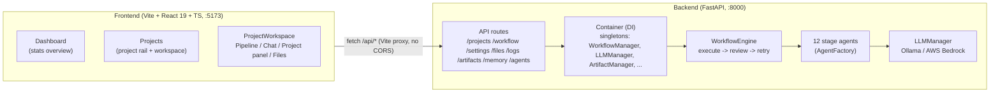
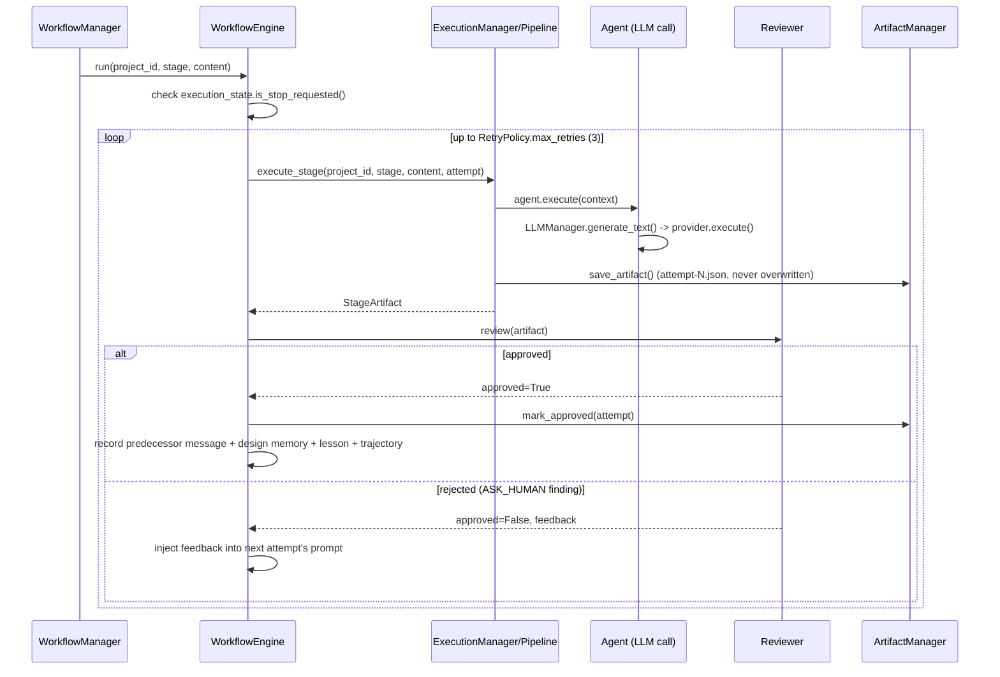
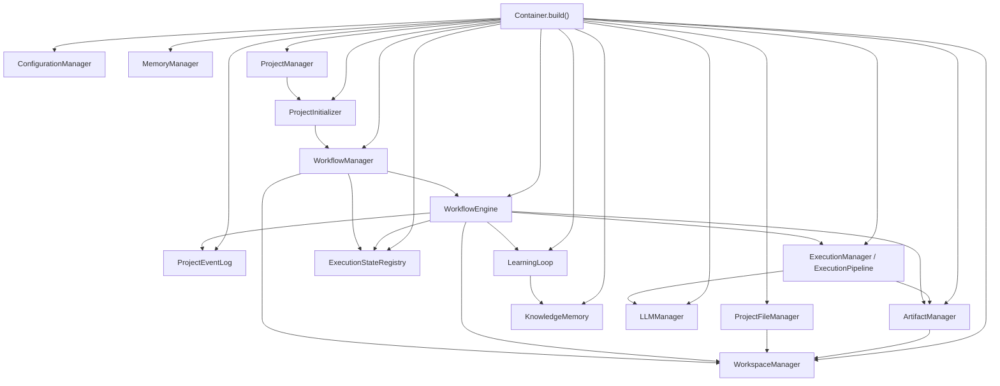
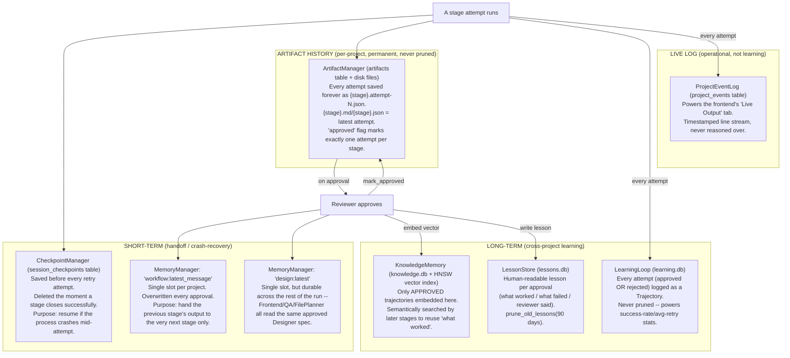

# AI DevOS — Current State, Architecture, and Memory Model

_Last updated: 2026-07-24. This document describes the system as it actually runs today, verified
against the code and against live pipeline runs in this session -- not the original aspirational
plan. Older docs in this folder (`PROJECT_OVERVIEW.md`, `STAGE-FLOW.md`, `LEARNING-SYSTEM.md`,
`DOC-001..100`) capture earlier planning stages and may no longer match the implementation; this
file supersedes them for "what actually exists right now."_

---

## 1. Objective

AI DevOS is a multi-agent software engineering pipeline: you describe an application in plain
English, and a fixed sequence of 12 specialized AI agents — each backed by an LLM call, a
structured-output schema, and an automated reviewer — carry it from idea to a real, downloaded,
runnable codebase. The goal is not a chatbot that talks about code; it's a pipeline that produces
files on disk you can `cd` into, `npm install`, and run.

Two things distinguish it from "ask an LLM to write an app in one shot":

- **Staged, reviewed handoffs.** Each stage's output is validated against a Pydantic schema and
  passed through an automated three-tier reviewer before the next stage ever sees it. A rejected
  attempt retries with the reviewer's actual feedback injected into the prompt, not a blind retry.
- **Real files, not artifacts pretending to be code.** Only two stages (Backend/Frontend Developer)
  write to the actual generated project directory; every other stage produces a reviewable document
  (architecture spec, design spec, security review, etc.) that the next stage reads as context.

---

## 2. High-level architecture

- **Backend**: Python 3.12, FastAPI, entirely synchronous (deliberate design choice — every
  manager, agent, and action is a plain sync call; there is no asyncio in the pipeline path).
- **Frontend**: Vite + React 19 + TypeScript, Tailwind v4 (CSS-first, no `tailwind.config.js`),
  hand-built shadcn/ui-style primitives over Radix. Talks to the backend only through `/api/*`,
  proxied by Vite's dev server to `http://localhost:8000` — zero CORS configuration needed.
- **LLM providers**: pluggable via `LLMFactory`/`LLMConfig`. Ships with `OllamaProvider` (local
  model, default `qwen2.5-coder:7b`) and `BedrockProvider` (AWS Bedrock Runtime Converse API,
  Bearer-token auth). Switchable at runtime via `GET/POST /settings/llm` without a restart; the
  choice persists to `backend/.env`.

---

## 3. The 12-stage pipeline

Defined in `app/workflow/dependency_graph.py::STAGE_ORDER`, resolved to agents via
`app/agents/factory.py`. Every stage after the first receives the previous stage's approved output
as context (see §4).

| # | Stage (registry key) | Agent | Produces | Depends on |
|---|---|---|---|---|
| 1 | `strategic_review` | StrategicReviewAgent | Go/no-go strategic assessment of the request | — |
| 2 | `product_owner` | ProductOwnerAgent | Requirements: goals, user stories, acceptance criteria | Strategic Review |
| 3 | `architect` | ArchitectAgent | Architecture: modules, API design, data models, tech stack | Product Owner |
| 4 | `designer` | DesignerAgent | Design spec: pages, components, layouts | Architect |
| 5 | `security` | SecurityAgent | Security review / findings | Designer |
| 6 | `file_planner` | FileStructurePlannerAgent | **File Plan**: concrete list of `{path, module, purpose, responsible_stage}` | Security |
| 7 | `backend` | BackendDeveloperAgent | **Real backend source files**, one LLM call per file | Security, File Plan |
| 8 | `frontend` | FrontendDeveloperAgent | **Real frontend source files**, one LLM call per file | Security, Designer, File Plan |
| 9 | `qa` | QAAgent | QA test plan / bug list | Backend, Frontend |
| 10 | `document` | DocumentAgent | Project documentation | QA |
| 11 | `devops` | DevOpsAgent | Deployment/ops guidance | Document |
| 12 | `retro` | RetroAgent | Retrospective | DevOps |

Only stages 7 and 8 write to `temp-workspace/{project_id}/project/{backend,frontend}/` — every
other stage's output lives only as a reviewable artifact document (see §5). This split exists
specifically so File Structure Planner can hand Backend/Frontend a **minimal, concrete file list**
instead of asking either one to invent an entire app's worth of files in a single response — the
one-file-per-call loop is what makes generation reliable on a small local model.

### The execute → review → retry cycle (every stage)

The reviewer (`app/review/reviewer.py`) tags every finding one of three ways, mirroring a
human-review severity model:
- **AUTO_FIX** — mechanical, never blocks approval (e.g. empty content is auto-flagged but doesn't
  count against approval by itself).
- **ASK_HUMAN** — the only tier that blocks approval; missing structured output, implausible
  content, or (for Backend/Frontend) incomplete file coverage against the File Plan.
- **FLAG** — advisory, noted in feedback but never blocking.

A stage is `approved` only when there are zero ASK_HUMAN findings.

---

## 4. How the modules connect

Everything is wired through one hand-built DI container (`app/kernel/container.py::Container`),
built once at process startup (`AIKernel.start()` in `app/kernel/kernel.py`) and resolved via
FastAPI `Depends()` in every API route (`app/api/dependencies.py`). Nothing constructs its own
"fresh" copy of a shared manager except where explicitly documented (see the `ProjectManager`
wiring fix in §7 — a real bug where it used to do exactly that).

**Request path** (e.g. `POST /workflow/start`):
`api/workflow.py` → `WorkflowManager.run()` (loops `DependencyGraph.ordered_stages()`, skipping
anything already in the project's persisted `stages_completed` — this is the **resume** behavior:
a build interrupted by a backend restart picks up from the first incomplete stage instead of
re-running everything) → `WorkflowManager.run_stage()` (marks `ExecutionStateRegistry` as running,
for real "is this actually executing" status) → `WorkflowEngine.run()` (the execute/review/retry
loop in §3) → `ExecutionManager.execute_stage()` → `ExecutionPipeline.run()` (resolves the agent via
`AgentFactory`, runs it, safety-checks the write via `SafetyPolicy`, persists via
`ArtifactManager`).

**Backend/Frontend Developer specifically** don't go through `ArtifactManager` for their actual
output — they use `WriteProjectFilesAction` (`app/actions/write_project_files.py`), which reads the
approved File Plan, loops one LLM call per assigned file, writes each through `ProjectFileManager`
(`app/workspace/project_files.py`) into `temp-workspace/{project_id}/project/{area}/`, and — new
this session — scans the files it just wrote for real `import`/`require` statements to
auto-generate a starter `package.json`/`requirements.txt` (`app/workspace/dependency_detector.py`).
The stage's own artifact is just a manifest (`planned_paths`/`written_paths`/`skipped_paths`), which
the Reviewer checks for coverage before approving.

**Project isolation**: every manager that touches disk or a shared SQLite DB namespaces by
`project_id` — `WorkspaceManager` gives each project its own `temp-workspace/{id}/` tree,
`MemoryManager` prefixes every key `"{project_id}:{key}"`, `ArtifactManager`/`ProjectFileManager`
scope every path under the project's workspace, `LearningLoop`'s pattern search is
project-scoped via a `"{project_id}:{stage}"` category key. Two projects running (or having run)
never see each other's predecessor messages, design specs, or generated files.

---

## 5. How each memory system contributes

There are **six distinct persistence systems**, each with a different lifetime and purpose — "memory"
here doesn't mean one thing.

| System | Backing store | Lifetime | What it answers |
|---|---|---|---|
| `MemoryManager` (`memory.db`) | SQLite key/value, key = `"{project_id}:{key}"` | Single-slot; overwritten each use (`workflow:latest_message`) or durable for the run (`design:latest`) | "What did the immediately-previous stage just approve?" |
| `CheckpointManager` (`memory.db`, `session_checkpoints`) | SQLite | Deleted on clean stage completion; survives only if the process crashed mid-attempt | "Was this session left incomplete?" (crash recovery, `list_incomplete()` at startup) |
| `ArtifactManager` (`memory.db`, `artifacts` table + `.md`/`.json`/`.attempt-N.json` files) | SQLite + disk | Permanent, every attempt kept forever | "What did every attempt of this stage actually produce, and which one was approved?" |
| `LearningLoop` (`learning.db`) | SQLite | Permanent, never pruned | "How often does this stage succeed, and after how many retries?" (stats, not retrieval) |
| `KnowledgeMemory` (`knowledge.db` + `.hnsw` index) | SQLite + HNSW vector index (sentence-transformers embeddings) | Permanent | "What's semantically similar to this task that has worked before?" — injected into a stage's prompt before it runs |
| `LessonStore` (`lessons.db`) | SQLite | Permanent, prunable at 90 days | "What have we explicitly learned for this exact stage/project?" — human-readable, not embedding search |
| `ProjectEventLog` (`memory.db`, `project_events`) | SQLite | Permanent (not really "memory" — an operational log) | "What's happening right now?" — powers the Live Output tab and `is_running` status accuracy |

**Why `attempt-1`/`attempt-2` files exist on disk**: `ArtifactManager.save_artifact()` writes a new
numbered file on every attempt, approved or not — deliberate, so a rejected attempt's content is
never lost and you can see exactly why the reviewer rejected it. The API already exposes only the
approved/latest view (`GET /artifacts/{project_id}/{stage}`, `list_artifacts()` filters to
`approved=1`); the raw numbered files are an audit trail meant for debugging, not the primary way to
read output.

---

## 6. Frontend architecture

- **`Dashboard`** (`/`) — stats overview: total/running/complete/failed project counts, recent
  projects list.
- **`Projects`** (`/projects`, `/projects/:projectId`) — a resizable project rail on the left;
  selecting a project renders `ProjectWorkspace` inline in the same page (not a separate
  navigation), so the project list stays visible while you work.
- **`ProjectWorkspace`** — the actual build interface, laid out as:
  - `WorkflowPanel` (full-width top): the 12-stage pipeline tracker, live stage/status per box.
  - Left column (resizable width): `BottomPanel` (Live Output / Artifacts tabs, resizable height) →
    `ProjectPanel` (name, status, original request, build textarea, Stop/Start/Resume Build) →
    `FileExplorer` (generated file tree, Download button, "How to Run" dialog).
  - Right column: `ChatPanel` — the stage-by-stage build conversation.
- **`SettingsPage`** — backend health, and the LLM provider picker (Ollama / Bedrock, model,
  region, API key — persisted server-side, never round-tripped back to the browser once set).
- **`AgentsPage` / `MemoryPage`** — read-only inspectors over `/agents` and `/memory/{project_id}`.

Everything talks through `src/lib/api.ts`, a single typed client hitting `/api/*` (Vite-proxied,
no CORS). Live updates are **polling-based, not WebSockets**: `useWorkflowStatus` (3s),
`useProjectLogs` (2.5s, `since_id` tailing), `useProjectFiles` (4s).

---

## 7. What's been done — progress this session

Roughly in the order these were found/fixed:

1. **Project isolation** — threaded `project_id` end-to-end through workspace, artifacts, and
   memory so two projects never collide.
2. **Full pipeline wiring** — all 12 stages actually run in order with real retry/review, replacing
   earlier stub behavior.
3. **Real code generation (Phase 0)** — replaced "ask Backend/Frontend to invent the whole app in
   one JSON blob" with File Structure Planner + one-LLM-call-per-file writing.
4. **`DELETE /projects/{id}` 400-despite-success bug** — `MemoryRepository.delete()` checked only
   an in-process cache, never populated for storage-backed reads; fixed to check storage directly.
5. **Pipeline resume** — `WorkflowManager.run()` now skips already-completed stages instead of
   restarting all 12 from scratch after any interruption (backend restart, crash, dropped request).
6. **Real Stop/accurate status** — added `ExecutionStateRegistry` so `GET /workflow/{id}` reports
   genuine in-flight execution (`running`) vs. merely-incomplete-but-idle (`paused`), and a real
   `POST /workflow/{id}/stop` that takes effect at the next retry/stage checkpoint.
7. **AWS Bedrock provider** — added alongside Ollama, runtime-switchable via `/settings/llm`,
   persisted to `.env`.
8. **Dashboard/Projects split + collapsible sidebar + resizable panels** (frontend).
9. **Code-generation root-cause fixes**:
   - `ProjectFileManager.write_file()` now sanitizes leading `/`/`\` and rejects `..` traversal —
     previously `Path("area") / "/x/y"` silently discarded `"area"` (pathlib treats a leading `/`
     as absolute), so generated files landed outside the project entirely with no error.
   - `SafetyPolicy` now blocks new-file writes outside `workspace_root` (previously unconditionally
     allowed any nonexistent path, masking the bug above).
   - `FileStructurePlanner`'s prompt/schema now explicitly distinguish API routes from file paths
     (the model was copying `POST /api/auth/login` straight into a file `path` field).
   - `ProjectManager`/`ProjectInitializer` now share the container's real `WorkflowManager`/
     `LLMManager` singleton instead of building a disconnected one — a new project's first stage
     used to silently ignore runtime provider switches.
10. **Download + Run Instructions** — `GET /projects/{id}/download` (zip of every real generated
    file + a generated `RUN_INSTRUCTIONS.md`), `GET /projects/{id}/run-instructions` (deterministic,
    stack-detected from actual file extensions, no extra LLM call).
11. **Auto-generated dependency manifests** — Backend/Frontend now scan their own written files'
    real `import`/`require` statements and write a starter `package.json`/`requirements.txt`, so
    "how to run" isn't just advice with nothing to install.

All of the above is covered by the backend test suite (194 tests passing at time of writing).

---

## 8. Known limitations / good next steps

- **Dependency versions aren't pinned** — the auto-generated manifest lists package names with `"*"`
  (npm) or no version (pip); it's a starting point, not a locked/reproducible build.
- **Stop can't interrupt a single in-flight LLM call** — it only takes effect between retry
  attempts or between stages, since the call to Ollama/Bedrock is a blocking HTTP request.
- **No true human-in-the-loop pause** — `ASK_HUMAN` is a reviewer severity label, not an actual
  pause-and-wait mechanism; a stage that exhausts retries just fails, to be manually retried.
- **Trajectories table has no `project_id` column** — `LearningLoop.count_all_trajectories()` is
  necessarily global; per-project trajectory counts aren't queryable directly (project scoping only
  applies to `KnowledgeMemory`'s search category).
- **Docs in this folder pre-date the implementation** — `PROJECT_OVERVIEW.md`, `STAGE-FLOW.md`,
  `LEARNING-SYSTEM.md`, and `DOC-001..100.md` describe earlier planning states and should be treated
  as historical, not current reference.
