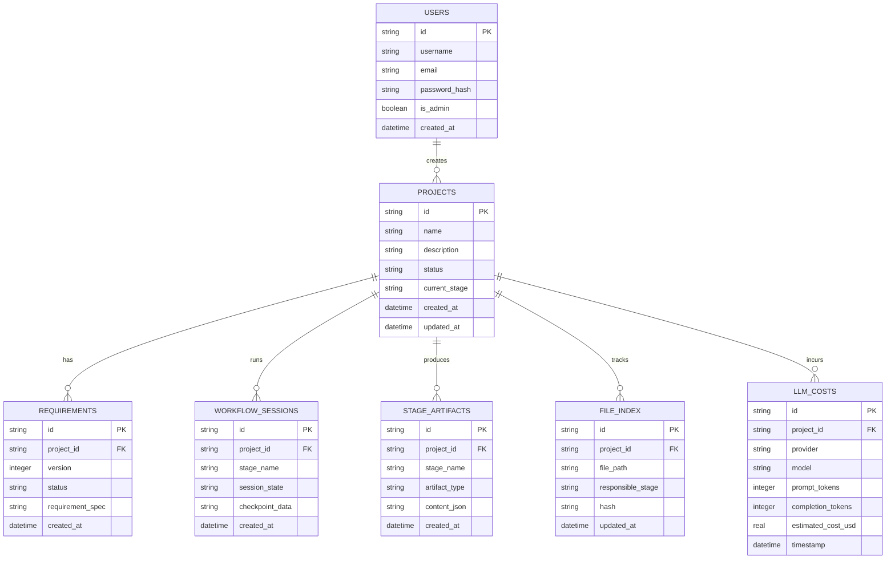

# Database Architecture Document — AI DevOS

> **Source of Truth**: Reverse-engineered from `backend/app/db/`, `backend/app/storage/`, `backend/data/`, and `backend/migrations/versions/0001_initial_baseline.py`.

---

## 1. Multi-Database Architecture

AI DevOS separates system state across multiple targeted SQLite databases rather than relying on a single monolithic database file. This guarantees decoupled data access, modular backup strategies, and domain isolation.

---

## 2. Database Inventory & File Mapping

| Database File | Storage Directory | Owner Module | Key Tables | Description |
| --- | --- | --- | --- | --- |
| `auth.db` | `data/auth.db` | `app/db/` & `app/api/auth.py` | `users`, `user_tokens`, `api_keys` | User authentication, JWT sessions, API keys |
| `memory.sqlite` | `data/memory.sqlite` | `app/memory/` | `projects`, `requirements`, `stage_artifacts`, `sessions` | Primary project state, stage artifacts, checkpoints |
| `costs.db` | `data/costs.db` | `app/llm/` | `llm_calls`, `cost_aggregates` | Token counts, execution latency, and financial costs |
| `file_index.db` | `data/file_index.db` | `app/workspace/` | `file_index`, `file_versions` | Tracks project file paths, hashes, and responsible stages |
| `knowledge.sqlite`| `data/knowledge.sqlite`| `app/intelligence/` | `semantic_snippets`, `vector_mappings` | Text metadata backing `knowledge.hnsw` vector index |
| `learning.sqlite` | `data/learning.sqlite` | `app/learning/` | `patterns`, `syntax_rules` | Extracted code generation patterns and syntax rules |
| `lessons.sqlite`  | `data/lessons.sqlite`  | `app/workflow/middleware/` | `lessons_learned`, `retro_items` | Retrospective lessons learned across project runs |

---

## 3. Detailed Table Schemas

### 3.1 `auth.db`
- **`users`**: `id` (VARCHAR(36) PK), `username` (VARCHAR(64) UNIQUE), `email` (VARCHAR(128) UNIQUE), `password_hash` (VARCHAR(255)), `is_admin` (BOOLEAN), `created_at` (DATETIME).
- **`api_keys`**: `id` (VARCHAR(36) PK), `user_id` (VARCHAR(36) FK), `key_hash` (VARCHAR(255) UNIQUE), `name` (VARCHAR(64)), `created_at` (DATETIME).

### 3.2 `memory.sqlite`
- **`projects`**: `id` (VARCHAR(36) PK), `name` (TEXT), `description` (TEXT), `status` (VARCHAR(32)), `current_stage` (VARCHAR(64)), `created_at` (TIMESTAMP), `updated_at` (TIMESTAMP).
- **`requirement_versions`**: `id` (VARCHAR(36) PK), `project_id` (VARCHAR(36) FK), `version` (INTEGER), `status` (VARCHAR(32)), `requirements_json` (TEXT), `created_at` (TIMESTAMP).
- **`stage_artifacts`**: `id` (VARCHAR(36) PK), `project_id` (VARCHAR(36) FK), `stage` (VARCHAR(64)), `artifact_type` (VARCHAR(64)), `data_json` (TEXT), `created_at` (TIMESTAMP).
- **`stage_sessions`**: `id` (VARCHAR(36) PK), `project_id` (VARCHAR(36) FK), `stage` (VARCHAR(64)), `session_state` (VARCHAR(32)), `checkpoint_blob` (BLOB), `updated_at` (TIMESTAMP).

### 3.3 `costs.db`
- **`llm_calls`**: `id` (VARCHAR(36) PK), `project_id` (VARCHAR(36)), `stage` (VARCHAR(64)), `provider` (VARCHAR(32)), `model` (VARCHAR(64)), `prompt_tokens` (INTEGER), `completion_tokens` (INTEGER), `total_tokens` (INTEGER), `cost_usd` (FLOAT), `timestamp` (TIMESTAMP).

---

## 4. Storage Adapter & Alembic Migrations

- **SQLite Storage Adapter (`app/storage/sqlite_storage_adapter.py`)**: Uses Python's native `sqlite3` library with write-ahead logging (`PRAGMA journal_mode=WAL;`) enabled for high-concurrency access.
- **Alembic Baseline (`migrations/versions/0001_initial_baseline.py`)**: Tracks schema versioning across `memory.sqlite` and `auth.db`.
- **Transactions (`storage_transaction.py`)**: Manages atomic context transactions via `with transaction_manager.begin():` blocks.
