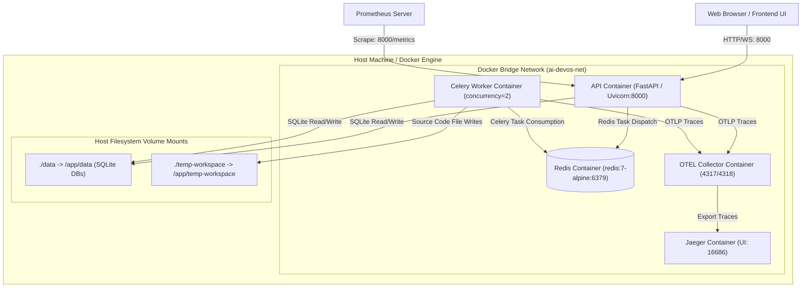

# Deployment & Infrastructure Architecture — AI DevOS

> **Source of Truth**: Extracted directly from `backend/Dockerfile`, `backend/docker-compose.yml`, `backend/otel-collector-config.yaml`, `backend/requirements.txt`, and `backend/.env.example`.

---

## 1. Deployment Topology Diagram

---

## 2. Docker Container Services Inventory

| Container Service | Base Image | Command / Entrypoint | Internal Port | Exposed Host Port | Health Check | Description |
| --- | --- | --- | --- | --- | --- | --- |
| `api` | `python:3.12-slim` | `uvicorn app.main:app --host 0.0.0.0 --port 8000` | 8000 | 8000 | `curl -f http://localhost:8000/ready` | Primary FastAPI REST and WebSocket server |
| `worker` | `python:3.12-slim` | `celery -A app.tasks.pipeline_task worker --loglevel=info --concurrency=2` | N/A | N/A | Celery ping check | Asynchronous workflow stage execution worker |
| `redis` | `redis:7-alpine` | `redis-server` | 6379 | 6379 | `redis-cli ping` | Message broker & Celery result backend |
| `otel-collector` | `otel/opentelemetry-collector-contrib:0.98.0` | `--config=/etc/otel/config.yaml` | 4317, 4318 | 4317, 4318 | Collector health endpoint | Receives and routes OpenTelemetry traces |
| `jaeger` | `jaegertracing/all-in-one:1.56` | Default entrypoint | 16686 | 16686 | Jaeger health check | Trace storage and visualization UI |

---

## 3. Environment Variables Reference

| Environment Variable | Default Value | Required | Purpose / Impact |
| --- | --- | --- | --- |
| `AUTH_ENABLED` | `false` | No | Toggles JWT authentication requirement |
| `JWT_SECRET_KEY` | `dev-secret-key-change-in-production` | Mandatory in Prod | Secret key for signing HS256 JWT tokens |
| `VALID_API_KEYS` | `""` | No | Comma-separated list of valid API keys |
| `CELERY_BROKER_URL` | `redis://localhost:6379/0` | No | Celery broker URL (Falls back to in-process if down) |
| `CELERY_RESULT_BACKEND` | `redis://localhost:6379/0` | No | Celery result storage backend |
| `OPENAI_API_KEY` | `""` | Optional | API key for OpenAI models (GPT-4o, etc.) |
| `ANTHROPIC_API_KEY` | `""` | Optional | API key for Anthropic models (Claude 3.5 Sonnet) |
| `GEMINI_API_KEY` | `""` | Optional | API key for Google Gemini models |
| `OLLAMA_BASE_URL` | `http://localhost:11434` | Optional | Base URL for local Ollama instance |
| `OTEL_ENDPOINT` | `""` | No | OpenTelemetry collector endpoint (e.g. `http://otel-collector:4317`) |
| `PROMETHEUS_ENABLED` | `false` | No | Exposes `/metrics` endpoint for Prometheus scraping |
| `ALLOWED_ORIGINS` | `http://localhost:5173,http://127.0.0.1:5173` | No | CORS allowed origins list |

---

## 4. Local Execution & Startup Scripts

- **Development Launch (Windows)**: `dev.bat`
  - Starts backend Uvicorn server (`uvicorn app.main:app --reload`) and frontend Vite dev server (`npm run dev`).
- **Development Launch (Linux/macOS)**: `dev.sh`
  - Shell equivalent starting Uvicorn and Vite servers.
- **Production Container Stack**: `docker compose up -d --build`
  - Spawns `api`, `worker`, and `redis` containers with persistent volume mounts.
- **Tracing Profile Stack**: `docker compose --profile otel up -d`
  - Spawns OpenTelemetry Collector and Jaeger UI (`http://localhost:16686`).
