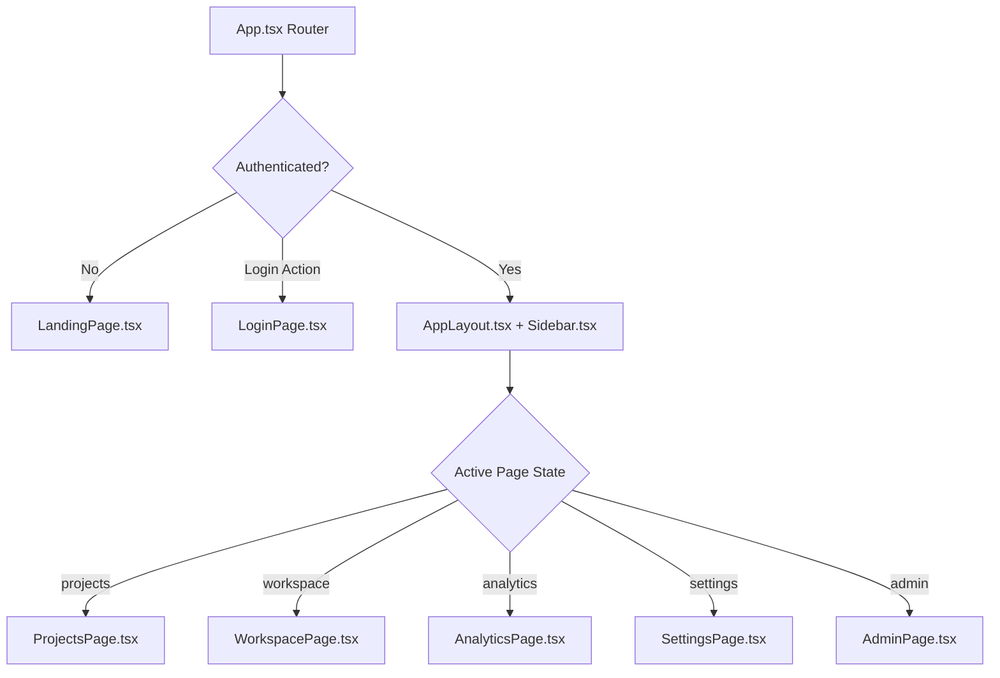

# Frontend Specification Document — AI DevOS

> **Source of Truth**: Extracted directly from `frontend/package.json`, `frontend/vite.config.ts`, and `frontend/src/`.

---

## 1. Technology Stack & Tooling

- **Core Framework**: React 18.3+ with TypeScript (`tsconfig.json`).
- **Build System**: Vite 5+ (`vite.config.ts`).
- **Styling**: Tailwind CSS (`tailwind.config.ts`) with custom glassmorphism and dark mode palette.
- **Icons & UI Utility**: `lucide-react` icons, custom responsive components (`components/ui/Spinner.tsx`).
- **Testing**: Vitest (`vitest.config.ts`), React Testing Library (`App.test.tsx`, `LandingPage.test.tsx`, `LoginPage.test.tsx`).
- **API Client**: Fetch/Axios wrapper (`lib/api.ts`) with automatic Bearer token header insertion.
- **Real-Time Streaming**: Native WebSocket hook (`hooks/useWebSocket.ts`).

---

## 2. Router & Page Architecture

Navigation is handled via React state and top-level view routing in `App.tsx`:

---

## 3. Page Breakdown & Features

### 3.1 `LandingPage.tsx`
- Feature overview, product capabilities, CTA to launch platform or log in.

### 3.2 `LoginPage.tsx`
- User authentication form (Username/Password), registration toggle, JWT token storage in `localStorage`.

### 3.3 `ProjectsPage.tsx`
- Displays list of created projects with status badges (`RUNNING`, `COMPLETED`, `WAITING_FOR_REVIEW`, `FAILED`).
- "New Project" modal form submitting project name, domain description, and tech stack preferences to `POST /api/v1/projects`.

### 3.4 `WorkspacePage.tsx` (Primary Operational Dashboard)
- **`StageRail.tsx`**: Visual multi-stage execution pipeline showing past, current, and upcoming stages with status indicators.
- **`ClarificationPanel.tsx`**: Renders pre-planning Q&A items when `Clarification` stage requires user input.
- **`DesignReviewModal.tsx`**: Modal for inspecting generated design specs and submitting gate approval/rejection decisions (`POST /api/v1/gates/{id}/review`).
- **`ArtifactsPanel.tsx`**: Displays generated Markdown artifacts (`StrategicBrief`, `Requirements`, `Architecture`, `SecurityRules`, `SprintPlan`).
- **`FileExplorer.tsx`**: Interactive workspace file tree allowing users to inspect synthesized source code files.
- **`LogsPanel.tsx`**: Real-time log stream viewer populated via `useWebSocket.ts`.
- **`MetricsPanel.tsx`**: Displays token usage, step count, and execution costs.
- **`QAPanel.tsx`**: Renders test results, assertion breakdowns, and bug analysis outputs.
- **`ChatPanel.tsx`**: Interactive chat interface for asking questions or requesting project updates.

### 3.5 `AnalyticsPage.tsx`
- System-wide token consumption, execution latency, and LLM cost charts queried from `/api/v1/analytics/costs`.

### 3.6 `SettingsPage.tsx`
- API Key management (`X-API-Key`), default LLM model selection (OpenAI / Anthropic / Gemini), theme preferences.

### 3.7 `AdminPage.tsx`
- Admin-only dashboard for managing registered users (`/api/v1/admin/users`) and system health.

---

## 4. Frontend vs. Backend Endpoint Parity

| Frontend Component | Backend API Endpoint | WebSocket Channel | Integration Status |
| --- | --- | --- | --- |
| `LoginPage.tsx` | `POST /api/v1/auth/login` | None | `CONNECTED` |
| `ProjectsPage.tsx` | `GET /api/v1/projects`, `POST /api/v1/projects` | None | `CONNECTED` |
| `StageRail.tsx` | `GET /api/v1/workflow/{id}/status` | `STAGE_PROGRESS` | `CONNECTED` |
| `DesignReviewModal.tsx` | `GET /api/v1/gates/{id}`, `POST /api/v1/gates/{id}/review` | `GATE_REQUIRED` | `CONNECTED` |
| `ArtifactsPanel.tsx` | `GET /api/v1/artifacts/{id}` | None | `CONNECTED` |
| `FileExplorer.tsx` | `GET /api/v1/files/{id}/tree`, `GET /api/v1/files/{id}/content` | None | `CONNECTED` |
| `LogsPanel.tsx` | `GET /api/v1/logs/{id}` | `LOG_EMITTED` | `CONNECTED` |
| `AnalyticsPage.tsx` | `GET /api/v1/analytics/costs` | None | `CONNECTED` |
| `AdminPage.tsx` | `GET /api/v1/admin/users` | None | `CONNECTED` |
| Live Web Preview Modal | `GET /api/v1/preview/{id}` | None | `PARTIAL` (Port mapping returned, hot-reloading iframe pending) |
