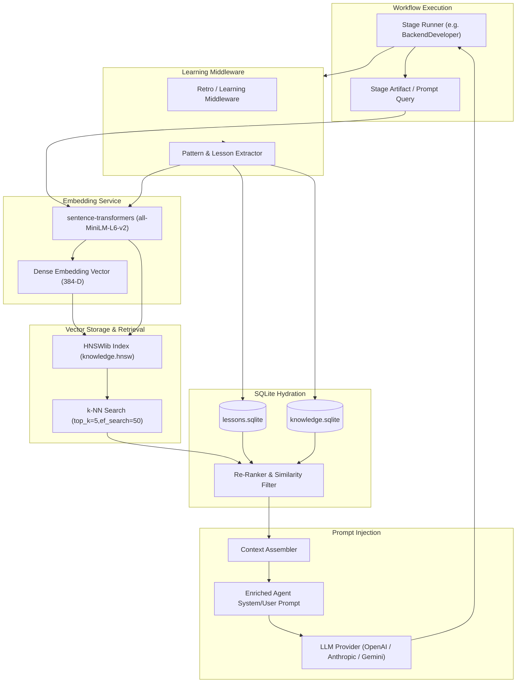

# Memory & RAG Subsystem Architecture — AI DevOS

> **Source of Truth**: Extracted directly from `backend/app/memory/`, `backend/app/intelligence/`, `backend/app/learning/`, `backend/data/`, and `backend/app/workflow/middleware/learning.py`.

---

## 1. Intelligence & Memory Architecture Overview

AI DevOS employs a hybrid vector-relational memory system to ground agent generations in project context, historical lessons, past bug solutions, and file dependency graphs:

1. **Relational Databases (SQLite)**: Store structured metadata, stage execution histories, raw lesson logs, and file index maps (`data/memory.sqlite`, `data/lessons.sqlite`, `data/learning.sqlite`, `data/knowledge.sqlite`, `data/file_index.db`).
2. **HNSW Vector Indexes (`hnswlib`)**: Perform fast approximate nearest-neighbor (k-NN) vector searches over 384-dimensional dense embeddings (`data/knowledge.hnsw`).
3. **Embedding Model (`sentence-transformers`)**: Uses `all-MiniLM-L6-v2` to compute embeddings for text prompts, stage artifacts, code snippets, and retro lessons.
4. **Context Assembler (`app/workflow/context_assembler.py`)**: Filters, ranks, and injects retrieved memory snippets into agent prompts before LLM invocation.

---

## 2. Memory Types & Isolation Levels

| Memory Type | Persistence Medium | Scope / Isolation | Purpose in Workflow |
| --- | --- | --- | --- |
| **Working Memory** | In-Memory (`StageContext`) | Single Stage Run | Transient inputs/outputs passed between adjacent stages |
| **Stage Artifact Memory** | `memory.sqlite` | Project-Scoped | Emitted stage outputs (`StrategicBrief`, `Requirements`, `Architecture`, etc.) |
| **Sprint-Scoped Memory** | `memory.sqlite` | Sprint-Scoped | Sprint plan, Scrum cards, file delta plan for current sprint |
| **Episodic Memory** | `memory.sqlite` | Project-Scoped | Event logs, reviewer feedback, execution traces, stage checkpoints |
| **Lessons Learned** | `lessons.sqlite` | Global / Cross-Project | Success/failure lessons extracted during retrospective stages |
| **Semantic Knowledge** | `knowledge.sqlite` + `knowledge.hnsw` | Global / Cross-Project | Architectural patterns, tech stack recommendations, reusable code snippets |
| **File Index Memory** | `file_index.db` | Project-Scoped | Tracks workspace file paths, tech stack assignments, modification timestamps |

---

## 3. Vector Index & RAG Lifecycle Diagram

---

## 4. Learning Middleware (`app/workflow/middleware/learning.py`)

- **Automatic Lesson Capture**: Executes post-stage hooks. When a stage completes or fails:
  - If successful: Captures prompt strategies, syntax-valid code patterns, and reviewer approval metadata.
  - If failed: Captures error tracebacks, syntax errors, and missing dependencies as negative patterns.
- **Index Syncing**: Generates embeddings for extracted patterns and atomically updates both `lessons.sqlite` and `knowledge.hnsw`.

---

## 5. Security & Isolation

### 5.1 Secret Scrubbing (Phase 7 — FEAT-003)

`app/memory/secret_scrubber.py` implements a `SecretScrubber` that redacts credential patterns from text **before** it reaches the embedding model, SQLite, or the HNSW index.

`KnowledgeMemory.store()` is the single gate for all write paths. The first operation inside the lock is `value = _scrubber.scrub_or_raise(value)`. If the scrubber itself raises, the call is aborted — unredacted text is never silently persisted.

Detected patterns (fail-safe: false positive preferred over false negative):

| Pattern | Examples |
| --- | --- |
| JWT tokens | `eyJ...` three base64url segments |
| AWS access key | `AKIA…`, `AGPA…`, `AIDA…`, `AROA…`, `ASIA…` |
| AWS secret key | 40-char base64 after `aws_secret_access_key=` |
| OpenAI / Anthropic sk- keys | `sk-proj-…`, `sk-ant-…` |
| Google API keys | `AIza…` |
| GitHub tokens | `ghp_`, `ghs_`, `gho_`, `ghr_`, `github_pat_` |
| Bearer tokens | `Authorization: Bearer …` (quoted or unquoted) |
| Generic API key assignments | `api_key=…`, `apiKey: "…"` |
| Password assignments | `password=…`, `passwd=…` |
| Env-var secrets | `BEDROCK_API_KEY=…`, `JWT_SECRET_KEY=…` |

Known limitations: regex-based only; does not detect secrets split across lines, custom-encoded secrets, or PEM/DER private keys.

### 5.2 Project Isolation via Category Filtering

`KnowledgeMemory.search()` accepts an optional `category_filter` parameter. All writes from `LearningLoop.record_trajectory()` use the key format `f"{project_id}:{stage}"` as the category. `ContextOrchestrator.build()` passes the same format as `category_filter`, so retrieval is strictly scoped to the current project and stage.

Cross-project leakage is architecturally impossible: a vector is only returned if its SQLite-stored `category` field exactly matches the filter. No fuzzy/prefix matching.

### 5.3 Project Scope Enforcer (Stage Artifacts)

`app/memory/sprint_scoped_memory.py` enforces explicit `project_id` SQL `WHERE` filtering on `memory.sqlite` queries to guarantee strict isolation for stage artifacts and sprint state.

### 5.4 Prompt Injection Defence

Retrieved memory is injected by `ContextOrchestrator.format_as_prompt_section()` inside a clearly labelled `━━━ PATTERNS FROM PAST RUNS ━━━` section. This places adversarial payloads in an explicitly-named data block that appears after system instructions, not before them.
