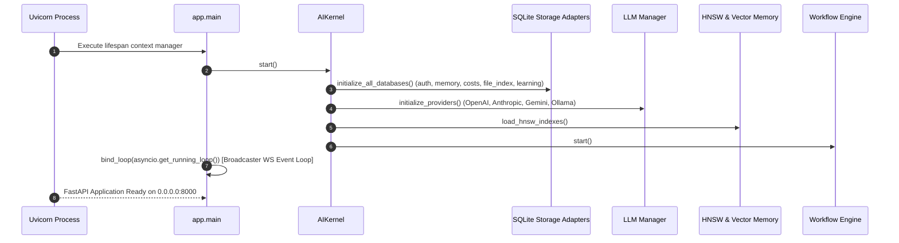
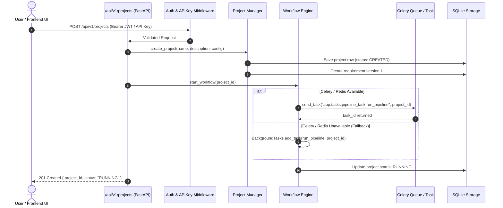
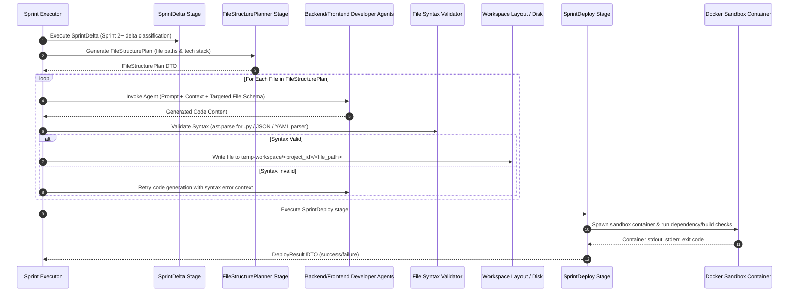
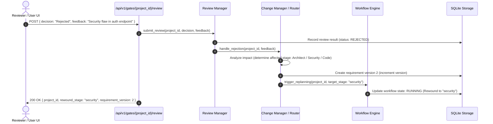
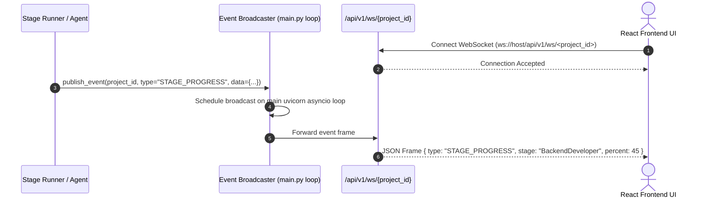

# Operational System Flow Document — AI DevOS

> **Source of Truth**: Reverse-engineered from `backend/app/main.py`, `backend/app/workflow/engine.py`, `backend/app/workflow/stage_runner.py`, `backend/app/workflow/sprint_executor.py`, and `frontend/src/`.

---

## 1. End-to-End Operational Lifecycle

The system operates across six distinct runtime phases:

```text
1. Application Startup & Initialization
   ↓
2. Project Creation & Workspace Initialization
   ↓
3. Pipeline Stage Execution (Clarification -> Product Owner -> Architect -> Security -> Sprint Planner)
   ↓
4. Sprint Execution Loop (Scrum Master -> File Delta -> File Planner -> Backend/Frontend Dev -> Deploy -> Review)
   ↓
5. Quality Assurance & Bug Replanning (QA Orchestrator -> Bug Analyst -> Retry Engine)
   ↓
6. Artifact Stamping, Documentation, Retro & Project Completion
```

---

## 2. Sequence Diagrams

### 2.1 Application Startup Flow



---

### 2.2 Project Creation & Workflow Dispatch Flow



---

### 2.3 Sprint Code Generation & Deploy Validation Flow



---

### 2.4 Reviewer Gate Rejection & Replanning Flow



---

### 2.5 Real-Time WebSocket Event Broadcasting Flow



---

## 3. Failure Recovery, Cancellation & Resume Mechanics

### 3.1 Failure & Retry Loop
- **Stage Retry**: `app/workflow/retry_engine.py` applies stage-specific retry policies (`max_retries`, backoff delay).
- **Intelligent Replanning**: If retries fail at execution stages, `BugAnalyst` parses log backtraces and adjusts stage inputs before attempting an additional execution pass.

### 3.2 Cancellation Flow
- Endpoint: `POST /api/v1/projects/{project_id}/cancel`.
- Action: Updates project state in `auth.db`/`memory.sqlite` to `CANCELLED`, revokes active Celery task via `celery_app.control.revoke(task_id, terminate=True)`, and notifies connected WebSocket subscribers.

### 3.3 Resume Flow
- Endpoint: `POST /api/v1/projects/{project_id}/resume`.
- Action: Reads latest valid stage checkpoint from `session_state` (`session/checkpoint.py`), reconstructs `StageContext`, and resumes workflow execution from the last uncompleted or failed stage.
