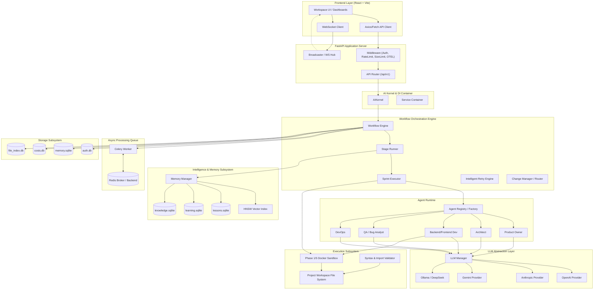

# Technical Architecture Document — AI DevOS

> **Source of Truth**: Based directly on static code structure in `backend/app/` and `frontend/src/`.

---

## 1. High-Level Architecture Overview

AI DevOS is architected as a modular, event-driven multi-agent system composed of:
1. **Frontend Presentation Layer**: Single-Page Application (SPA) built with React, Vite, TypeScript, and Tailwind CSS.
2. **FastAPI Application Server**: RESTful API endpoints, WebSocket event streams, authentication, rate limiting, request context binding, and Swagger/OpenAPI documentation.
3. **AI Kernel & Dependency Injection Container**: `AIKernel` manages the lifecycle of shared system singletons (LLM Manager, Memory Manager, Database Connection Manager, Workflow Engine, Execution Engine).
4. **Workflow Orchestration Engine**: Evaluates pipeline graphs defined in `workflow.json`, manages sprint-scoped stages, executes gate reviews, handles retries, and coordinates Celery task dispatches.
5. **Multi-Agent Runtime & Factory**: Instantiates role-specific agents (`ProductOwnerAgent`, `ArchitectAgent`, `BackendDeveloperAgent`, `FrontendDeveloperAgent`, `QAAgent`, `DevOpsAgent`, etc.) with strict schemas and prompt templates.
6. **LLM Provider Abstraction Layer**: Unified multi-provider manager supporting OpenAI, Anthropic, Gemini, Ollama, DeepSeek, and custom API endpoints with model profiling and fallback chains.
7. **Intelligence & Vector Memory Subsystem**: Multimodal memory manager integrating HNSW vector indexes for semantic similarity search with SQLite persistent stores (`lessons.sqlite`, `learning.sqlite`, `knowledge.sqlite`).
8. **Containerized Execution Sandbox**: Isolated Docker runner for executing builds, dependency resolution, syntax validation, unit tests, and smoke deployments.
9. **Multi-Database Persistence Layer**: Modular SQLite storage adapters managing domain data across `auth.db`, `memory.sqlite`, `costs.db`, `file_index.db`, and `learning.sqlite`.

---

## 2. System Subsystem Diagram



---

## 3. Directory Layout & Module Responsibilities

```text
backend/app/
├── api/                # FastAPI endpoint routers, middleware, exception handlers
├── artifact/           # Artifact models, status, and stamping services
├── agents/             # Agent implementations (PO, Architect, Developer, QA, DevOps, etc.)
├── config/             # Config loader (PyYAML), environment settings, model profile defaults
├── context/            # Context assemblers and prompt context injection logic
├── db/                 # Database initialization, session factory, Alembic engine hooks
├── events/             # Event hub, broadcaster, and WebSocket event distribution
├── execution/          # Docker container sandbox runner, command execution, syntax validators
├── integration/        # External service integration schemas and API clients
├── intelligence/       # RAG orchestrator, knowledge indexer, vector ranker
├── kernel/             # AIKernel lifecycle management and dependency injection container
├── learning/           # Retro learner, pattern analyzer, lesson extractor
├── llm/                # LLM Manager, provider factories, model profiles, cost trackers
├── memory/             # HNSW vector store, SQLite memory store, working/episodic memory
├── observability/      # Structlog logging, OpenTelemetry tracing, Prometheus metrics
├── project/            # Project manager, state machine transitions, project repositories
├── prompt/             # Prompt template loader, indexer, Jinja/markdown renderer
├── review/             # Gate review manager, reviewer rules, decision logic
├── runtime/            # Agent registry, agent factory, dependency provider
├── session/            # Stage session checkpoints, session manager
├── shared/             # Shared DTOs, Enums, Exceptions, Models, and Pydantic Schemas
├── storage/            # SQLite storage adapter, transaction context manager, health checks
├── tasks/              # Celery task definitions (pipeline_task.py)
├── workflow/           # Workflow engine, stage runner, sprint executor, retry engine
└── workspace/          # File registry, project layout, dependency pinner, Git manager
```

---

## 4. Subsystem Details

### 4.1 AIKernel (`app/kernel/kernel.py`)
- **Lifecycle**: `AIKernel.start()` initializes database storage connections, LLM managers, vector memory stores, and the workflow engine upon FastAPI startup.
- **Container**: `ServiceContainer` exposes singletons (`llm_manager`, `memory_manager`, `workflow_engine`, `project_manager`, `docker_sandbox`) to FastAPI dependency injectors (`app/api/dependencies.py`).

### 4.2 Workflow Engine & Sprint Executor (`app/workflow/`)
- **Engine (`engine.py`)**: Manages project pipeline state transitions. Checks for Redis availability: if Redis is healthy, dispatches tasks via `celery_app.send_task()`; otherwise, executes tasks in-process via FastAPI background tasks.
- **Stage Runner (`stage_runner.py`)**: Runs single-stage executions. Assembles prompt context from previous stage artifacts and memory, invokes the corresponding agent, validates response schemas, and records checkpoint state.
- **Sprint Executor (`sprint_executor.py`)**: Orchestrates sprint cycles (Sprint 1 to Sprint N). Handles `ScrumMaster`, `SprintDelta`, `FileStructurePlanner`, `BackendDeveloper`, `FrontendDeveloper`, `SprintDeploy`, and `SprintReview`.

### 4.3 LLM Subsystem (`app/llm/`)
- **Providers**: `OpenAIProvider`, `AnthropicProvider`, `GeminiProvider`, `OllamaProvider`, `DeepSeekProvider`.
- **Manager (`manager.py`)**: Selects providers based on request parameters (`dto/llm_request.py`), tracks token usage and financial cost in `costs.db`, and formats responses (`dto/llm_response.py`).

### 4.4 Intelligence & Vector Memory (`app/memory/`, `app/intelligence/`)
- **HNSW Memory Store**: Implements approximate nearest-neighbor vector search over embedding vectors using `hnswlib`.
- **Embedding Generation**: Uses `sentence-transformers` (`all-MiniLM-L6-v2`) to turn code snippets, retro lessons, and requirement descriptions into dense vector embeddings.
- **SQL Persistence**: Detailed memory entries are indexed in `data/memory.sqlite`, `data/lessons.sqlite`, `data/learning.sqlite`, and `data/knowledge.sqlite`.

### 4.5 Execution Sandbox (`app/execution/`)
- **Docker Sandbox (`docker_sandbox.py`)**: Spawns isolated Docker containers with restricted network access, volume-mounted project workspaces (`temp-workspace/<project_id>`), and timeout guards to safely execute untrusted generated code and test suites.
- **Syntax Validator (`file_validator.py`)**: Verifies Python syntax (`ast.parse`) and JSON/YAML validity before files are written into the workspace repository.
