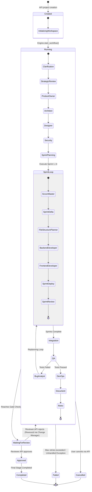

# Workflow State Machine Specification — AI DevOS

> **Source of Truth**: Extracted directly from `backend/app/shared/enums/workflow_state.py`, `stage.py`, `project_state.py`, `session_state.py`, `review_decision.py`, `backend/app/workflow/workflow.json`, `engine.py`, `state_machine.py`, and `transition_manager.py`.

---

## 1. Enums & State Definitions

### 1.1 `WorkflowState` (`app/shared/enums/workflow_state.py`)
- `Created`: Initial state when project workflow is registered.
- `Running`: Active execution of standard or sprint stages.
- `WaitingForReview`: Paused at a gate awaiting human reviewer decision.
- `Approved`: Human reviewer approved stage outputs.
- `Completed`: Workflow successfully finished all pipeline and sprint stages.
- `Failed`: Unrecoverable execution error or retry limit exhausted.

### 1.2 `ProjectState` (`app/shared/enums/project_state.py`)
- `CREATED` / `PLANNING` / `IN_PROGRESS` / `IN_REVIEW` / `COMPLETED` / `FAILED` / `CANCELLED`.

### 1.3 `Stage` Enum (`app/shared/enums/stage.py`)
| Enum Value | Standard / Sprint | Blocking | Outputs Emitted | Description |
| --- | --- | --- | --- | --- |
| `Clarification` | Standard | False | `ClarificationResult` | Interactive Q&A for requirement disambiguation |
| `StrategicReview` | Standard | False | `StrategicBrief` | Evaluates business goals and target scope |
| `ProductOwner` | Standard | True | `Requirements` | Generates detailed requirements specification |
| `Architect` | Standard | True | `Architecture` | System architecture, tech stack & database design |
| `Designer` | Standard | False | `Design` | UI/UX component hierarchy and design spec |
| `Security` | Standard | False | `SecurityRules` | Security controls, auth policies, threat modeling |
| `SprintPlanning` | Standard | True | `SprintPlan` | Multi-sprint breakdown and sprint goals |
| `Integration` | Standard | False | `IntegrationPlan` | Third-party client & API integration schemas |
| `QA` | Standard | False | `QAReport` | Unit & integration test execution report |
| `BugAnalyst` | Standard | False | `BugAnalysis` | Failure backtrace analysis and bug root causes |
| `DevOps` | Standard | False | `DeploymentPlan` | Docker, CI/CD, and deployment infrastructure |
| `Document` | Standard | False | `Documentation` | User documentation and system README |
| `Retro` | Standard | False | `RetroReport` | Retrospective evaluation and lesson extraction |
| `ScrumMaster` | Sprint Stage | False | `ScrumMasterPlan` | Breaks sprint goals into task cards |
| `SprintDelta` | Sprint Stage | False | `SprintDeltaPlan` | Classifies files into create/update/patch (Sprint 2+) |
| `FileStructurePlanner` | Sprint Stage | True | `FileStructurePlan` | Formulates file tree, paths, and tech assignments |
| `BackendDeveloper` | Sprint Stage | True | `BackendCode` | Generates backend Python source files |
| `FrontendDeveloper` | Sprint Stage | True | `FrontendCode` | Generates frontend TypeScript/React source files |
| `SprintDeploy` | Sprint Stage | False | `DeployResult` | Validates build, syntax, and smoke deployment |
| `SprintReview` | Sprint Stage | False | `SprintReviewReport` | Summarizes sprint quality and outputs |

---

## 2. State Transition Diagram

---

## 3. State Transition Matrix

| Current Workflow State | Trigger Event | Next Workflow State | Implementation File | Verified Code Status |
| --- | --- | --- | --- | --- |
| `Created` | `start_workflow(project_id)` | `Running` | `app/workflow/engine.py` | `VERIFIED` |
| `Running` | Stage completed successfully | `Running` (Next Stage) | `app/workflow/transition_manager.py` | `VERIFIED` |
| `Running` | Stage encounters gate requirement | `WaitingForReview` | `app/review/manager.py` | `VERIFIED` |
| `WaitingForReview` | `POST /gates/{id}/review` (`Approved`) | `Running` (Next Stage) | `app/api/gates.py` | `VERIFIED` |
| `WaitingForReview` | `POST /gates/{id}/review` (`Rejected`) | `Running` (Rewound Stage) | `app/workflow/change_manager.py` | `VERIFIED` |
| `Running` | Unrecoverable error / Retry exhausted | `Failed` | `app/workflow/retry_engine.py` | `VERIFIED` |
| `Running` | `POST /projects/{id}/cancel` | `Cancelled` | `app/api/project.py` | `VERIFIED` |
| `Running` | All pipeline and sprint stages finished | `Completed` | `app/workflow/engine.py` | `VERIFIED` |
